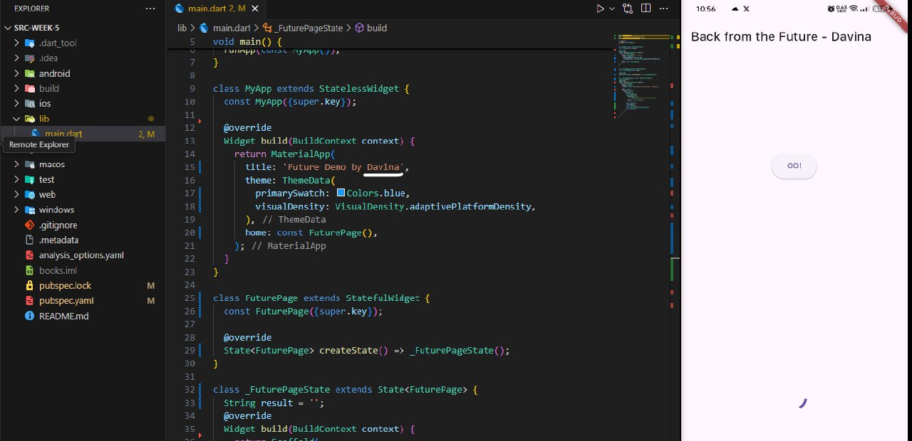
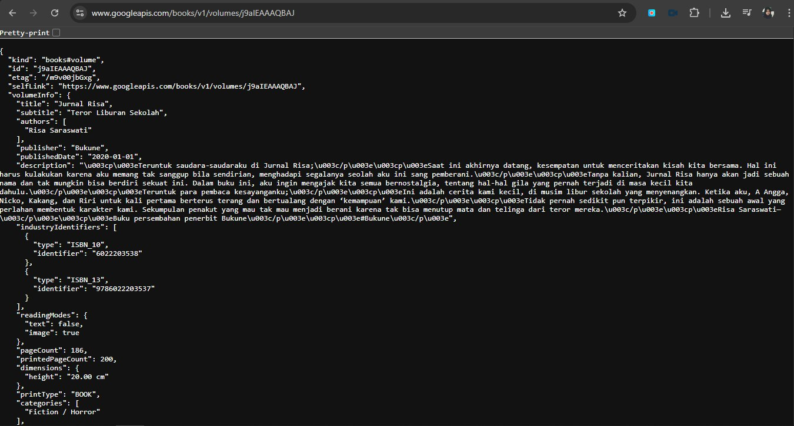
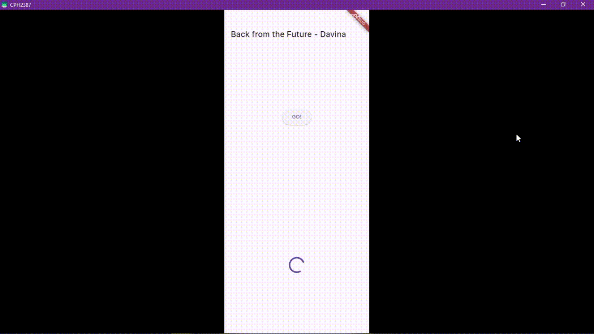
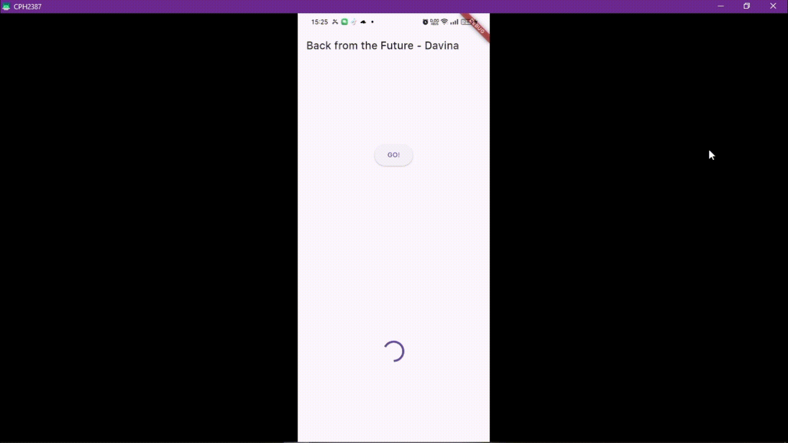
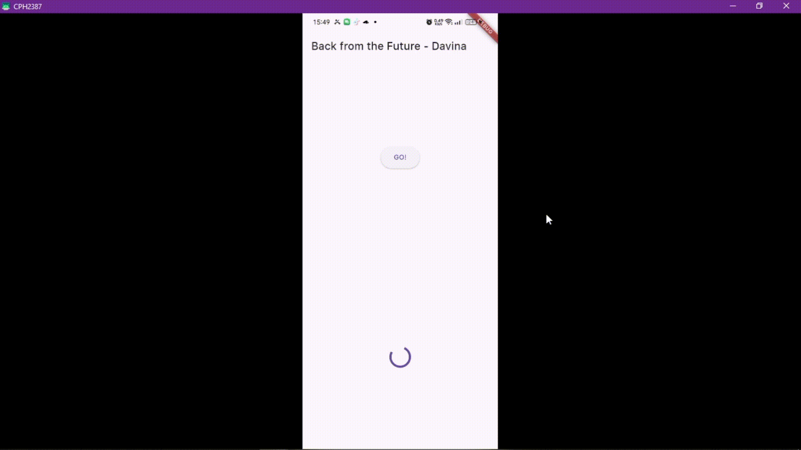
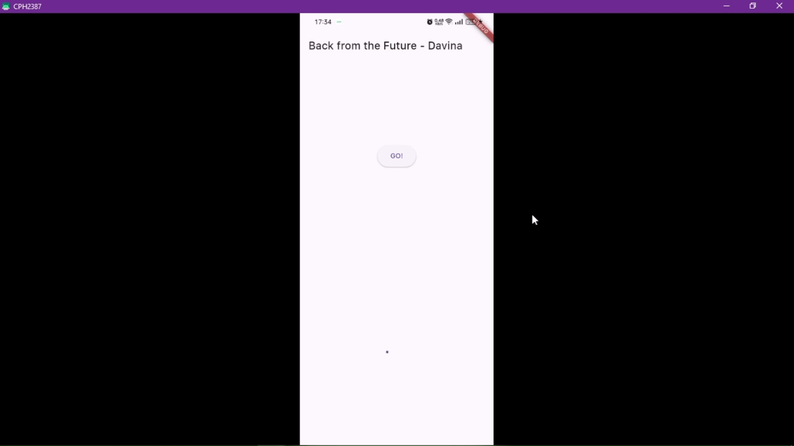
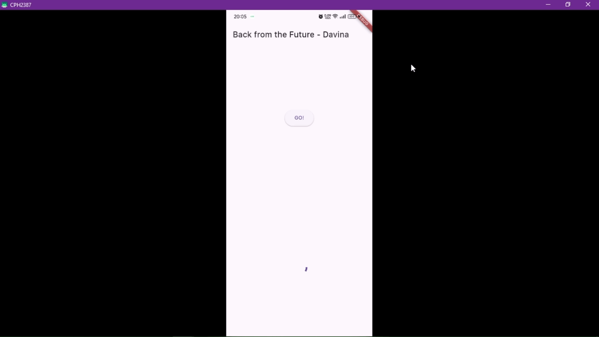
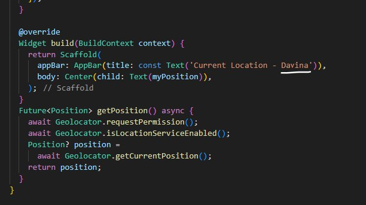

# Flutter - Pemrograman Asynchronous

## Praktikum 1 - Mengunduh Data dari Web Service (API)
**Soal 1**
- Tambahkan nama panggilan Anda pada title app sebagai identitas hasil pekerjaan Anda.  

  

**Soal 2**
- Carilah judul buku favorit Anda di Google Books, lalu ganti ID buku pada variabel path di kode tersebut. Kemudian cobalah akses di browser URI tersebut dengan lengkap. Lakukan capture milik Anda dan tulis di README pada laporan praktikum.  

  

**Soal 3**
- Jelaskan maksud kode langkah 5 tersebut terkait substring dan catchError!  
> kode `substring(0, 450)` berfungsi untuk memotong teks agar hanya tampil 450 karakter pertama. Sedangkan, kode `catchError((_) { })` berfungsi untuk menangani error saat mengambil data agar aplikasi tetap berjalan.
- Capture hasil praktikum Anda berupa GIF dan lampirkan di README

    

## Praktikum 2: Menggunakan await/async untuk menghindari callbacks
**Soal 4**
- Jelaskan maksud kode langkah 1 dan 2 tersebut!  
> Kode tersebut mensimulasikan tiga proses asynchronous (`returnOneAsync`, `returnTwoAsync`, dan `returnThreeAsync`) yang masing-masing menunggu selama 3 detik sebelum mengembalikan angka 1, 2, dan 3. Ketiganya dipanggil secara berurutan dalam method `count()`, lalu hasilnya dijumlahkan menjadi 6 dan ditampilkan ke UI lewat `setState`. Jadi, kode ini melatih penggunaan `async/await` untuk proses berurutan dan update tampilan setelah semua proses selesai.
- Capture hasil praktikum Anda berupa GIF dan lampirkan di README.

  

## Praktikum 3: Menggunakan Completer di Future
**Soal 5**
- Jelaskan maksud kode langkah 2 tersebut!  
> Langkah ini membuat sistem penundaan hasil menggunakan `Completer`, yaitu cara manual untuk menyelesaikan `Future`. Variabel `late Completer completer`; disiapkan untuk menyimpan proses yang akan diselesaikan nanti. Saat `getNumber()` dipanggil, `calculate()` dijalankan dan setelah 5 detik, `completer.complete(42)`; mengirim nilai 42 sebagai hasil.
- Capture hasil praktikum Anda berupa GIF dan lampirkan di README.

  

**Soal 6**
- Jelaskan maksud perbedaan kode langkah 2 dengan langkah 5-6 tersebut!
> Pada langkah 5 dan 6, method `calculate()` dimodifikasi untuk menangani kemungkinan error dengan `try-catch`, di mana jika berhasil akan menyelesaikan `Future` dengan `completer.complete(42)` setelah delay 5 detik, dan jika terjadi error maka akan memicu `completer.completeError({})`. Kemudian di langkah 6, pemanggilan `getNumber()` pada tombol diganti agar menggunakan `.then()` untuk menangani hasil sukses dan `.catchError()` untuk menangani error. Jika berhasil, hasil ditampilkan di UI, dan jika gagal akan muncul pesan `'An error occurred'`  
- Capture hasil praktikum Anda berupa GIF dan lampirkan di README.

  

## Praktikum 4: Memanggil Future secara paralel
**Soal 7**
- Capture hasil praktikum Anda berupa GIF dan lampirkan di README

  

**Soal 8**
- Jelaskan maksud perbedaan kode langkah 1 dan 4!  
> Langkah 1 menggunakan `FutureGroup` untuk menambahkan future satu per satu dan harus ditutup manual dengan `.close()`, sedangkan langkah 4 lebih ringkas dengan `Future.wait` yang langsung mengeksekusi kumpulan future dalam satu langkah tanpa penambahan atau penutupan manual.

## Praktikum 5: Menangani Respon Error pada Async Code
**Soal 9**
- Capture hasil praktikum Anda berupa GIF dan lampirkan di README.

  

**Soal 10**
- Panggil method handleError() tersebut di ElevatedButton, lalu run. Apa hasilnya? Jelaskan perbedaan kode langkah 1 dan 4!
> Langkah 1 hanya berisi fungsi `returnError()` yang secara sengaja melemparkan exception setelah delay 2 detik tanpa penanganan, sehingga jika dipanggil langsung bisa menyebabkan error tidak tertangani. Sementara itu, langkah 4 membungkus pemanggilan `returnError()` dalam fungsi `handleError()` menggunakan `try-catch-finally` untuk menangkap error, menampilkan pesan kesalahan ke UI dengan `setState`, dan memastikan `print('Complete')` tetap dijalankan. Dengan begitu, langkah 4 memberikan cara yang lebih aman dan terkontrol dalam menangani error.

## Praktikum 6: Menggunakan Future dengan StatefulWidget
**Soal 11**
- Tambahkan nama panggilan Anda pada tiap properti title sebagai identitas pekerjaan Anda.

  